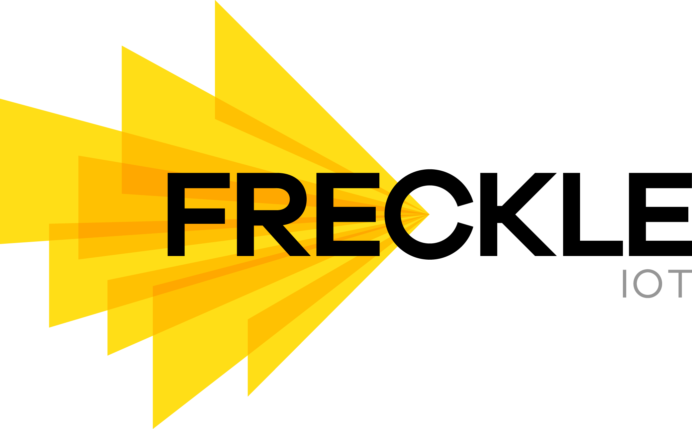

The FreckleSDK from [Freckle](http://www.freckleiot.com/)

## About FreckleSDK for iOS

Freckle SDK enables your app to serve premium, hyper-localized contextual ads using the Freckle location network. 

In this version of the SDK, your app will gain access to the Freckle beacon network. Your app will be able to serve ads at any of the selected Freckle enabled locations. When a device with an app running Freckle SDK passes by an iBeacon that has been registered with Freckle, the app is notified. The SDK requires the app to have a deployment target of 8.0 or above.

This leads to one of three scenarios:

1.	**The app is running.**

	If this is the case, a notification appears in the app. Tapping on 
	this notification sends the user to a predetermined web page.

2. 	**The app is running, but is in the background.**

	In this case iOS sends the user a notification. This notification appears 
    in standard iOS fashion, either on the user’s lock screen (if the phone is
    inactive) or from the top of the screen if the user is in another app or
    on the home screen. Tapping on the notification opens the app, which in 
    turn redirects the user to the predetermined web page.

3. 	**The app is not running, but has been run at least once before.**

	In this case iOS sends a notification to the user’s lock screen or to the top of the screen. Tapping or
    sliding this notification has the same effect as scenario 2.

## Install

To install with cocoapods, add the following line in your pod file:

    pod 'Freckle', :git => 'https://github.com/ant900/Freckle.git'

# Integration

To integrate the Freckle SDK into an existing project you just have to:

* Enable the application to respond to beacons via the project settings
* Call the Freckle SDK's instantiation method in your app delegate with the **API Key obtained from Freckle IOT**.
* Forward the Freckle Notifications to the SDK.

## Project Settings

In order for your Application to respond to Beacons properly there are a few settings you must update in the project.

### Capabilities

1. In XCode, click on the project icon in the explorer pane. 
2. Select the appropriate target, and click on **Capabilties**.
3. Toggle **Background Modes** to ON if not already
4. Under **Modes:** make sure both **Location updates** and **Uses Bluetooth LE accessories** are selected.

### Location Dialog

When the app requests the location of the user, it is important to declare the reason. If you do not already request the location you can follow these steps. If you already have a message you may want to modify it to include some information.

1. In XCode, click on the project icon in the explorer pane. 
2. Select the appropriate target, and click on **Info**.
3. Under **Custom iOS Target Properties** add a key for **NSLocationAlwaysUsageDescription**.
4. For the value enter something descriptive such as *'Your location is used to find and alert you of exclusive offers around you.'*

## Instantiating the SDK

In the app delegate of the app implementing the SDK, import the framework:
    
    #import <FreckleSDK/FreckleSDK.h>

The SDK is lazily instantiated. To activate it, in application **didFinishLaunchingWithOptions:** method of the app delegate, initialize the SDK.

    // Instantiate the Freckle SDK with API Key
    [FreckleSDK startWithToken:@"<YOUR API KEY>"];

There are other convenience methods privided with the SDK to see the state of the SDK.
    
    // Check the see if the SDK is authorized to use location and
    // the device's bluetooth
    BOOL isFreckleAuthorized = [FreckleSDK isAuthorized];
    
    if (isFreckleAuthorized) {
        NSLog(@"Freckle SDK is authorized");
    } else {
        NSLog(@"Freckle SDK is unauthorized, location may be off or idfa may not be present");
    }

In order for the SDK to respond to the notifications you must pass the notification into the SDK. To activate it, in the app delegate implement the following method:

    - (void)application:(UIApplication *)application didReceiveLocalNotification:(UILocalNotification*)notification
    {
        // This will only react to notifications sent from the SDK
        if ([notification.userInfo[@"from"] isEqualToString:@"FreckleSDK"]) {
            [FreckleSDK receivedNotification:notification];
        } else {
            // Your own code reacting to the notifications should be
            // implemented here
        }
    }

## Advanced SDK configuration

The SDK allows for the developer to change settings related to the integration. This allows for the customization of, but not limited to, whether to show the Freckle Notification Opt-in dialog and whether to let Freckle ask for the appropriate location services. Customization is done by passing in a **FreckleConfiguration** object into the SDK instantiation, a demonstration is shown below.
        
    // Instantiate the Freckle SDK
    FreckleConfiguration *config = [[FreckleConfiguration alloc] init];

    // Whether to show the notification opt-in dialog
    config.shouldShowNotificationDialog = YES;

    // Whether to ask the user for location
    config.shouldShowLocationDialog = YES;

    // Whether the SDK should use location
    config.locationOptIn = FreckleOptInStatusAllowed;

    // Whether the notifications should show up for this user
    config.notificationOptIn = FreckleOptInStatusAllowed;

    // Any information you may want to send to the Freckle server for integration purposes. This is just a NSDictionary that will be converted to JSON. Must be serializable with NSJSONSerialization.
    config.integrationData = @{
                               @"user_id" : @"john_smith",
                               @"favorite_fruit" : @"banana"
                               };
    [FreckleSDK startWithToken:<YOUR API KEY> andConfiguration:config];

## Programmatic Opt-Out and Opt-In

The SDK will automatically ask the user to opt-in when the user first starts the app. The user should always have the option to opt out from receiving notifications and location tracking by the Freckle SDK. You should have a toggle in your app settings to allow the user to opt out or to opt back in. 

Set both settings to FreckleOptInStatusDenied if user opts out, and set both to FreckleOptInStatusAllowed if user opts back in:

    // Turn off location portion of the SDK
    [FreckleSDK configuration].locationOptIn = FreckleOptInStatusDenied;

    // Opt-out of receiving Freckle notifications.
    [FreckleSDK configuration].notificationOptIn = FreckleOptInStatusDenied;

## Significant Location Change 

The SDK will automatically update beacon data in the background when a significant location change is detected. In order for this feature to work properly, implement the follow methods in the App Delegate. 

    - (void)applicationDidEnterBackground:(UIApplication*)application {
        [FreckleSDK invalidateAllTimers];
    }

    - (void)applicationWillEnterForeground:(UIApplication*)application {   
        [FreckleSDK resumeAllTimers];
    }

## Background Fetch

The SDK will automatically update beacon data in the background when the beacon datas are expired. To enable this feature, implement the method below in the App Delegate and enable Background fetch in Background Modes under Capabilities of your app target. Note: This feature requires SDK v1.8 and Significant Location Change to be implemented first.

    -(void)application:(UIApplication *)application performFetchWithCompletionHandler:(void (^)(UIBackgroundFetchResult))completionHandler{

        static BOOL fetching = NO;
        if (!fetching) {
            fetching = YES;
            [FreckleSDK fetchBeaconList:^(BOOL success) {
                if (success){
                    completionHandler(UIBackgroundFetchResultNewData);
                } else{
                    completionHandler(UIBackgroundFetchResultNoData);
                }
                fetching = NO;
            }];
        } else{
            completionHandler(UIBackgroundFetchResultNoData);
            NSLog(@"Can't fetch while another fetch is going on");
        }
    }

## Example App Delegate

For reference here is a complete App Delegate with the SDK implemented.

    //
    //  AppDelegate.m
    //  Freckle
    //
    //  Copyright (c) 2015 Freckle IOT. All rights reserved.
    //

    #import "AppDelegate.h"
    #import <CoreLocation/CoreLocation.h>
    #import <FreckleSDK/FreckleSDK.h>

    // View Controller
    #import "ViewController.h"

    @interface AppDelegate ()
    @property (nonatomic) ViewController *viewController;
    @end

    @implementation AppDelegate

    - (BOOL)application:(UIApplication *)application didFinishLaunchingWithOptions:(NSDictionary *)launchOptions {
        // Instantiate the Freckle SDK with API Key
        [FreckleSDK startWithToken:@"<YOUR API KEY>"];
        
        // Check the see if the SDK is authorized to use location and
        // the device's bluetooth
        BOOL isFreckleAuthorized = [FreckleSDK isAuthorized];
        if (isFreckleAuthorized) {
            NSLog(@"Freckle SDK is authorized");
        } else {
            NSLog(@"Freckle SDK is unauthorized, location may be off or idfa may not be present");
        }

        self.window = [[UIWindow alloc] initWithFrame:[[UIScreen mainScreen] bounds]];
        self.viewController = [[ViewController alloc] init];
        self.viewController.version = [FreckleSDK version];
        self.window.rootViewController = self.viewController;
        [self.window makeKeyAndVisible];
        
        return YES;
    }

    - (void)applicationWillResignActive:(UIApplication *)application {
    }

    - (void)applicationDidEnterBackground:(UIApplication *)application {
    }

    - (void)applicationWillEnterForeground:(UIApplication *)application {
    }

    - (void)applicationDidBecomeActive:(UIApplication *)application {
    }

    - (void)applicationWillTerminate:(UIApplication *)application {
    }

    - (void)application:(UIApplication *)application didReceiveLocalNotification:(UILocalNotification*)notification
    {
        // This will only react to notifications sent from the SDK
        if ([notification.userInfo[@"from"] isEqualToString:@"FreckleSDK"]) {
            [FreckleSDK receivedNotification:notification];
        } else {
            // Your own code reacting to the notifications should be
            // implemented here
        }
    }
    @end

## License

Copyright (c) 2016 by FreckleIOT
http://www.freckleiot.com

All Rights Reserved

Usage of this library implies agreement to abide by the [license
terms](LICENSE) and Freckle terms of
service.